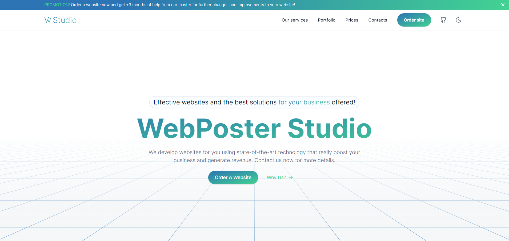

<h4 align="center">Добро пожаловать в репозиторий проекта WebMelenium Studio! Мы создаем невероятные веб-сайты для вашего бизнеса!</h3>

[](#)

## 🤖 О WebMelenium Studio

Веб-сайт для компании по разработке веб-приложений с более чем 5 страницами.

## 🛠 Используемые технологии

Мы собрали отличный технологический стек для создания WebMelenium Studio:

- [React](https://react.dev/)
- [NextJs](https://nextjs.org/)
- [TypeScript](https://www.typescriptlang.org/)
- [Scss](https://sasscss.org/)

**Библиотеки:** [`TailwindCss`](https://tailwindcss.com/), [`NextUI`](https://nextui.org/),[`Framer Motion`](https://www.framer.com/motion/), [`Atropos`](https://atroposjs.com/), [`Resend`](https://resend.com/), [`React-Hot-Toast`](https://react-hot-toast.com/)`

## 🚀 Начало работы

- Клонируйте репозиторий
- Установите зависимости с помощью `yarn install`

```bash
 yarn install
```

- Запустите сервер разработки с помощью `yarn dev`

```bash
 yarn dev
```

- Откройте браузер и перейдите по адресу `http://localhost:3000`

## 📜 Контактная информация

**ИП Меленчук Алексей Артемович**
- ИНН: 784303134201
- Телефон: +7-950-760-08-91
- Email: alexey.melenchuk@gmail.com

## 🤝 Вклад в проект

Ваш вклад в этот проект ценен! Не стесняйтесь открывать issues или отправлять pull requests, если у вас есть идеи по улучшению. Спасибо!
